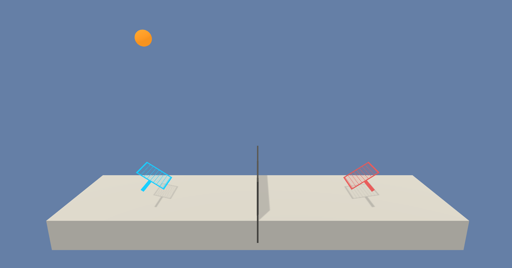

# README
# Project 3: Collaboration and Competition
## Udacity Deep Reinforcement Learning Nanodegree


## Introduction

This repository shows how `Project 3: Collaboration and Competition` ("Tennis") from the Udacity Deep Reinforcement Learning Nanodegree was tackled.

The README provides some general information. The repository also contains source code as well as a report.


## Project details



_(Udacity)_

The goal of the project is to use Deep Reinforcement Learning to teach two agents to play a version of tennis against one another. In this game, each agent is rewarded for keeping the ball in play. However, an agent is not additionally rewarded if its opponent is unable to keep the ball in play. Unlike regular tennis, this makes the game cooperative rather than competitive.

More specifically, each agent has its own eight-dimensional state-space, tracking the position and velocity of the ball and racket. The action-space for each agent is continuous in two dimensions, controlling movement towards and away from the net, as well as jumping. If an agent keeps the ball in play, it receives a reward of 0.1. If it fails to keep it in play, it receives a reward of -0.01.

Learning is episodic. An agent's score in an episode is taken to be the agent's sum of undiscounted rewards. An episode's total score is taken be the _maximum_ of the two agents' scores in that episode. Training is considered to have been successful once the average episode score over the most-recent 100 episodes is at least 0.5.

The environment is driven by the [Unity Machine Learning Agents Toolkit](https://github.com/Unity-Technologies/ml-agents). 


## Setup

The following steps will create the computing environment that was used for training.

1. On AWS, spin up a p2.xlarge instance in the N. Virginia region using the Udacity AMI `ami-016ff5559334f8619`.
2. Once the instance is up and running, SSH into the instance.
3. Run the following commands to clone the appropriate Udacity repository and install some Python dependencies:

	```
	conda activate pytorch_p36

	cd ~
	mkdir -p external/udacity

	cd ~/external/udacity
	git clone https://github.com/udacity/deep-reinforcement-learning.git

	cd ~/external/udacity/deep-reinforcement-learning/python
	pip install .	
	```

4. Download resources required for the environment:

	```
	cd /home/ubuntu/external/udacity/deep-reinforcement-learning/p3_collab-compet
	wget https://s3-us-west-1.amazonaws.com/udacity-drlnd/P3/Tennis/Tennis_Linux_NoVis.zip
	unzip Tennis_Linux_NoVis.zip
	```
	
	Note that for this step, 'no visualisation'-flavoured resources are used.
	
	
5. To correct an error in Jupyter Notebook/Lab that occurs in this computing environment as of 2019-08, perform the following:

	```
	pip install 'prompt-toolkit<2.0.0,>=1.0.15' --force-reinstall
	```
		
6. Deactivate the conda environment:

	```
	conda deactivate
	```
	
7. Securely set up Jupyter:

	```
	cd ~/
	mkdir ssl
	cd ssl
	openssl req -x509 -nodes -days 365 -newkey rsa:1024 -keyout "cert.key" -out "cert.pem" -batch	
	
	jupyter notebook --generate-config
	jupyter notebook password  # Enter and verify a password.
	
	```
	
8. Using an editor, add the following to the top of the `~/.jupyter/jupyter_notebook_config.py` file:

	```
	c = get_config()
	c.NotebookApp.certfile = u'/home/ubuntu/ssl/cert.pem'
	c.NotebookApp.keyfile = u'/home/ubuntu/ssl/cert.key'
	c.IPKernelApp.pylab = 'inline'
	c.NotebookApp.ip = '*'
	c.NotebookApp.open_browser = False	
	```
	
9. Start Jupyter Lab:

	```
	cd
	jupyter lab	
	```
	
10. If the EC2 security group that's in force allows traffic to port 8888, point a local browser to https://[ec2-ip-address]:8888. Otherwise execute the following in a _local_ terminal:

	```
	sudo ssh -L 443:127.0.0.1:8888 ubuntu@[ec2-ip-address]
	```
	
	Then point a local browser to https://127.0.0.1.


## Training

To replicate training, navigate to `~/external/udacity/deep-reinforcement-learning/p2_continuous-control/src` within Jupyter Lab. Open the `train.ipynb` notebook and follow the steps therein.
