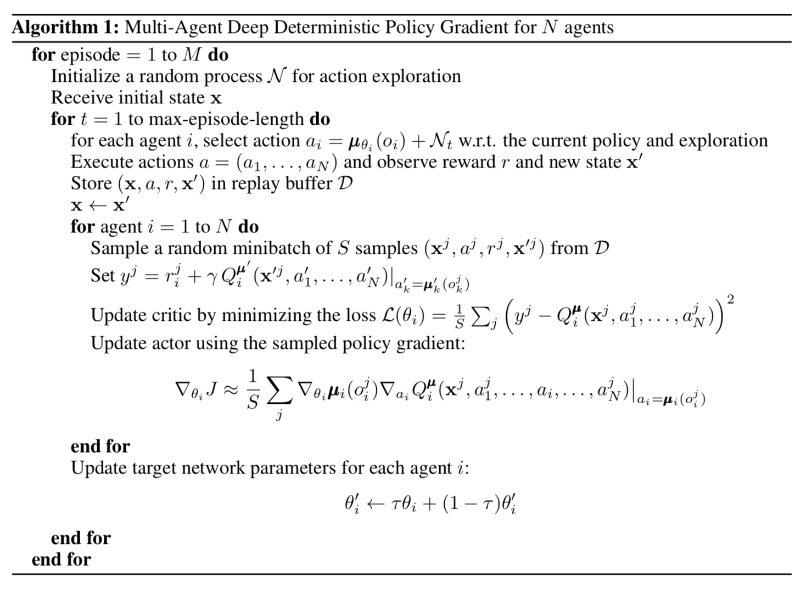
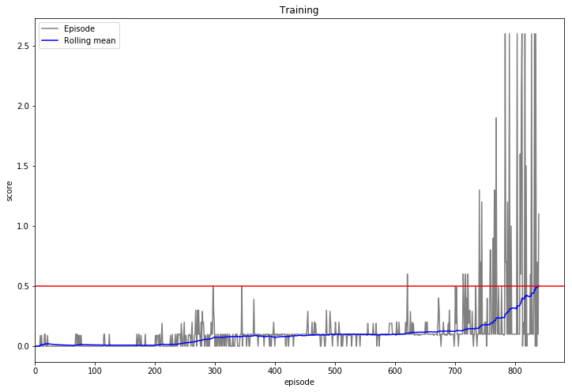

# REPORT
# Project 3: Collaboration and Competition
## Udacity Deep Reinforcement Learning Nanodegree

## Introduction

In this report, details are given of a solution to `Project 3: Collaboration and Competition` ("Tennis") of the Udacity Deep Reinforcement Learning Nanodegree.

## Project details

_This section has been copied from the README file._

_(Udacity)_

The goal of the project is to use Deep Reinforcement Learning to teach two agents to play a version of tennis against one another. In this game, each agent is rewarded for keeping the ball in play. However, an agent is not additionally rewarded if its opponent is unable to keep the ball in play. Unlike regular tennis, this makes the game cooperative rather than competitive.

More specifically, each agent has its own eight-dimensional state-space, tracking the position and velocity of the ball and racket. The action-space for each agent is continuous in two dimensions, controlling movement towards and away from the net, as well as jumping. If an agent keeps the ball in play, it receives a reward of 0.1. If it fails to keep it in play, it receives a reward of -0.01.

Learning is episodic. An agent's score in an episode is taken to be the agent's sum of undiscounted rewards. An episode's total score is taken be the _maximum_ of the two agents' scores in that episode. Training is considered to have been successful once the average episode score over the most-recent 100 episodes is at least 0.5.

The environment is driven by the [Unity Machine Learning Agents Toolkit](https://github.com/Unity-Technologies/ml-agents). 

## Approach

The [Multi-Agent Deep Deterministic Policy Gradients (MADDPG)](https://arxiv.org/abs/1706.02275) technique was implemented. It was implemented for $n$ agents, with $n$ then set to 2. From the paper, the full algorithm is as follows:

Note that each agent has its own actor network as well as its own critic network. However, while each critic network is informed of the state and action of all agents, each agent's actor network knows only of that agent's state.

$\mathcal{N}$ was taken to be a Gaussian distribution with mean 0 and a standard deviation that decreases by some factor (up to some minimum) after each learning step. (See the particulars in the next section.)

Furthermore, it's worth remembering that $J(\theta)$ equals the expected return $\mathbb{E}[Q(s, a) \vert_{s=s_t, a_t = \mu(s_t)}]$, which is to be maximised. Therefore instead of using the expression for $\Delta_{\theta_i}J$ as in the algorithm above, $J(\theta)$ can be directly optimised using autograd software such as PyTorch by maximising the value of

	critic.forward(states, actor.forward(states)).mean()

over the network parameters of actor $i$. See [here](https://towardsdatascience.com/deep-deterministic-policy-gradients-explained-2d94655a9b7b) for more details.

## Agent Controller

The following hyperparameters were used during training. For full details, see `src/train.ipynb` and `src/agent_controller.py`.

| Hyperparameter | Value | Description |
|--- |---	|--- |
| agents_n | 2 | The number of agents. |
| state\_shape\_all | (2, 8) | The agent x state-space size. |
| action\_shape\_all | (2, 2) | The agent x action-space size. |
| buffer\_size | 1e6 | The replay buffer size. |
| buffer\_size\_before\_learning | 500 | The minimum buffer size before learning starts. |
| update\_every | 1 | Learning occurs each multiple of this number of steps. |
| epochs\_n | 3 | The number of times a minibatch is sampled at each learning step for each agent. |
| batch\_size | 256 | The minibatch size. |
| noise\_weight\_start | 1 | The start weight applied to the standard Guassian noise that is added to actions. |
| noise\_weight\_factor | 0.999 | The factor by which the noise weight is updated with after each noise step. |
| noise\_weight\_min | 0.1 | The minimum value to be used by the noise weight. |
| gamma | 0.99 | The reward discount factor. |
| tau | 0.01 | Used for soft-updating the parameters of the "slow" networks. |
| actor\_learning\_rate | 3e-4 | The learning rate used for the actor networks. |
| critic\_learning\_rate | 3e-4 | The learning rate used for the critic networks. |

## Results

For this project, the agent controller was trained only once. In its single training, the agent controller was able to solve the problem over the episodes 742 to 841. 

## Ideas for future work

* The MADDPG implementation above doesn't exploit the symmetry between the two agents in this problem. Think of ways to do so.
* Investigate the implementation of a multi-agent version of PPO.
* Work through [this](https://arxiv.org/abs/1810.05587) paper, surveying the latest and greatest in multi-agent RL. Try other techniques.

## Conclusion

MADDPG is able to solve the Tennis problem in 742 episodes or fewer.
